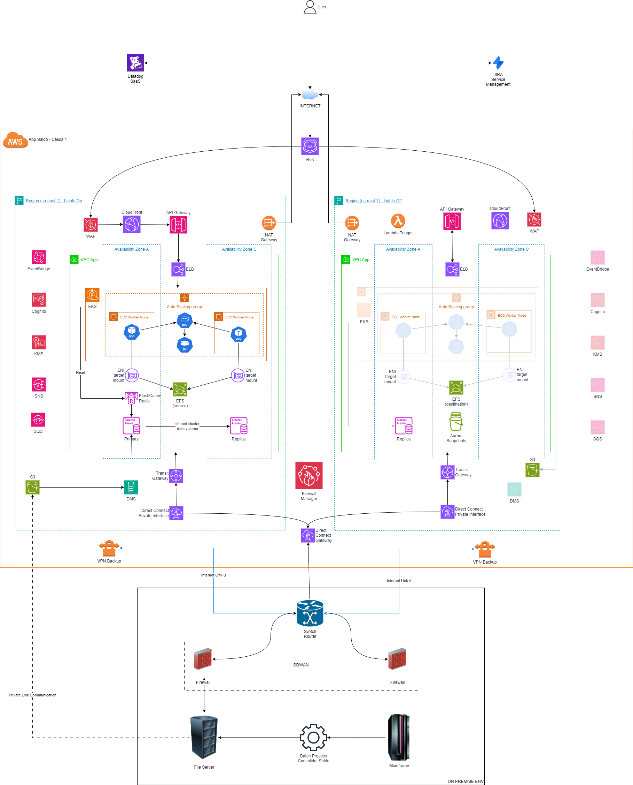

# Fotton Labs

Bem vindo ao Fotton Labs. O seu repositório de soluções para infraestrutura de TI.

Aqui você vai encontrar informações a respeito do desenho e construção de recursos de infraestrutura de TI baseado no que há de mais usual pelas maiores e mais destacadas empresas de diversos segmentos. 

Terá conhecimento das práticas e metodologias usadas e toda abordagem e conhecimento necessário para utilizar os mesmos templates e sugestões, alinhado às boas práticas de mercado e às normas vigentes sobre o uso de cada segmento e tecnologia.

No meu entendimento e experiência de anos atuando em empresas do setor financeiro e em consultorias globais parceiras de  AWS, Microsoft e Google, a melhor maneira de exemplificar suas capacidades é através da demonstração de suas habilidades de entregar aquilo que você está vendendo e/ou propondo a adoção.

Em TI, demonstrar significa, principalmente nos dias de hoje, em infraestrutura, provisionar todos os recursos tecnológicos que sustentam diversos tipos de aplicações, sob as mais diversas exigências em termos de disponibilidade, elasticidade e capacidade de suportar crescimentos e reduções sem interrupção e/ou degradação dos serviços de uma aplicação.

Enfim, todos sabemos que para o provisionamento de uma aplicação não somente são necessários os conhecimentos sobre as tecnologias, como também são, tão importantes ou até mais importantes, a maneira como se relacionam as tecnologias e como as diversas possibilidades e combinções se adequam melhor a umas situações ou outras.

Isso tudo, geralmente, é definido a partir dos requisitos da aplicação e de um grande conhecimento e experimentação pelo times de Arquitetura, que através de POCs(Proof of Concept) desenham e prototipam essas hipóteses para propor melhorias e/ou novas abordagens, que acabam se tornando padrões de construção pelas empresas e são replicadas entre os profissionais de TI pelo mundo.

Assim, o intuito desse repo é identificar e detalhar no máximo possível TODO o conhecimento inerente às diversas demandas de algumas das mais conhecidas funções e papéis dentro das verticais de infraestrutura e segurança de TI mais usuais e mais comumente adotadas, de modo a servidr como proposta de referência agnóstica para o uso de cases semelhantes ou idênticos.

Vale lembrar que, como apoio para definição dos perfis, estou seguindo um roteiro de conhecimento muito interessante, que conheço há muito tempo e uso como uma espécie de bíblia para o meu aperfeiçoamento pessoal, que o site roadmap.sh. Super recomendo.

Vamos ao que interessa, os cases. 

Boa leitura. Divirta-se!

-----------------------------------------------------------------------------------

Conforme comentado acima, vamos atravessar todos os cases, imaginando que estamos participando de todos os processos, desde o nascimento das workloads até seu provisionamento e produção/sustentação tanto em nuvem quanto para as situações em que tecnologias OnPremise foram mais adequadas e/ou limitadas a esse, tal qual como é o papel do Arquiteto de Soluções Cloud na maior parte das empresas.
Sendo assim a estrutura proposta para o ciclo de vida de nossas aplicações conterá as seguintes fases:

[## 1. Processos de Design](designprocess.md#2. Processos de Provisionamento)

## 2. Processos de Provisionamento
   
## 3. Processos de Validação e Testes

## 4. Processos de Deploy

## 5. Processos de Sustentação

-----------------------------------------------------------------------------------

Abaixo temos os links diretos para os cases já desenvolvidos no FottonLabs:

## 1. Cases

   ### 1. Case 1 - AppSaldo

         
